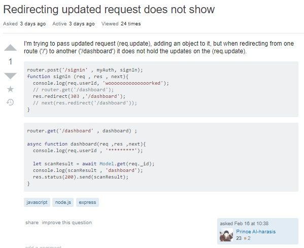
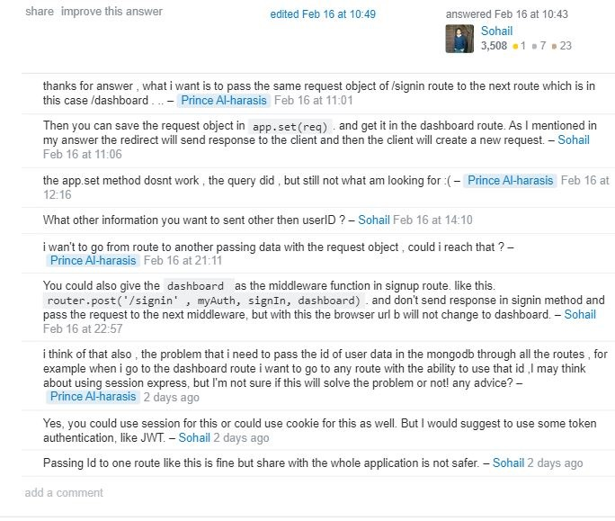

# Yallah-Ride

You wanna Ride? You wanna share your Ride?
What are you waiting for? JOIN US NOW !!

## Getting Started

### Setup

```js
// clone this repository
~ git clone 
```

```js
// cd into the project directory
~ cd Yallah-Ride
```


#### `.env` requirements (where applicable)

- `PORT` - 3000
- `MONGODB_URI` - mongodb://localhost:27017/please

#### How to initialize/run your application (where applicable)

- e.g. `npm start`


## Running the tests

- Testing Framework `jest` as test runner and assertion tool
- `eslint` for linting code style
- Pull Requests are not merged until all tests pass


## Deployment

TODO: Add additional notes about how to deploy this on a live deployment platform

## Authors

* **AbdelRahman Harasees** - *Initial work* - [GitHub](https://github.com/dantemessy)

* **Rashid Sawalqa** - *Initial work* - [GitHub](https://github.com/Rashid-alsawalqa)

* **Fatima Shubeilat** - *Initial work* - [GitHub](https://github.com/FatimaShubeilat)

## License

This project is licensed under the MIT License - see the [LICENSE.md](LICENSE.md) file for details

## Acknowledgments

* Hat tip to Mr.Brian, our instructor and inspiration.

# Overview

* Our application is a RESTful API that helps to implement our collective knowledge that we learned throughout our 401 advanced Javascript experience. This course was introduced and taught through Luminous Technical University College and the content was powered by Codefellows Software Development Academy.  We also utlitized many new learning new opportunities and implementations through documentation and other resources.

Through this application you have the full CRUD (create, read, update, delete) data operations which is oriented for driving and riding offers.

# What is Yallah-Ride?

Same as the hitchhiking idea which is used to get a lift with passing vehicles when traveling.  With the use of this application, Yallah-Ride provides a more secure and a safer way than hitchhiking.

# Why Yallah-Ride  

* Provide alternative ride options for people that normally travel using a bus, a train, or a taxi.
* Reducing the cost for riders, as the ride cost will be split on both the driver and rider.  There is also an option if the driver only wants to have company, which allows for offers of a free ride.
* You will have the chance to meet friendly people through the application, which then would give you and them a lifetime of friendship!
* Our application reduces the carbon footprint and helps save the environment. This decreases the overall use of cars, which will reduce traffic.

## How does it work?

Yallah-Ride is where a user can search for available pickup locations that has the same destination that they are willing to go to. The Yallah-Ride services includes the following:

- Data is manually created, for testing the results that shows on the search page.
- Sign-in/sign-up shows the username and password that is required to use the application. 
- Allow customers to create an account either through the website itself or through using their Facebook account to sign-up/sign-in.
- When the user does the sign-in/sign-up process, they will be able to see the dashboard which shows all relavent information.
- The dashboard will show the option of filling out the form, which contains 2 form types. The first form type is for the rider's request and the second one is for the driver's request. This allows the customer the ability to select and book a pickup and also to find new rides.
- The user also has a search button that enables them to search for either driver requests or rider requests. This filters the results based on the users choice.
- Each request has different data that is shown to the user as follows:
- A driver fills in a form and adds information about time to start the trip, the cost of the trip, and the destination that shows the city and it's specific street name/number, along with the car type, and the available number of seats.
- A rider finds the driver's posts and gets in touch with the driver to discuss details. The rider can post a request by filling out a form and adding information about time to be picked up, cost, and the destination that shows the city and it's specific street name/number.
- The driver is not required to do extra services, they are only required to go to the stated destination that they have shared.
- A cost feature will show three options that is determined by the rider, to state that it does cost some amount, which implies that riders must participate in the sharing of all ride costs.  There is also an option that will show this.


# Current Version (0.1.0)

The current version of this program is designed to create, read, update, and delete for a user account, and their posts.
This API is scalable and it is expected to be developed and released with new versions.

# Future Releases

V 1.0.0 will include the following enhancements:

* Allow customers to share live trip data with friends and family
* Show trip summary with the distance traveled
* Drivers can look for passengers who have a drivers license
* Adding temper and mood settings for the companion may be important for some drivers and riders.  This may show if they are interested in chatting during long rides
* Routes will be tracked via GPS
* Addition of accepting multiple payment methods

# Architecture

This API adopts the Model View Controller(MVC) pattern.


This is a server-side and client-side application, each using an architecture/framework that promotes maintainability, scalability, and collaboration. 

The technologies that we used are: `node.js` for our server, the node.js `http` module, `express.js` middleware, and a MongoDB database. Unix, Git, GitHub, ESLint, MongoDB, Heroku, Continuous Integration through GitHub actions, ES6, JSDoc, Swagger, Jest, Socket.IO, and Express we used throughout.

Concepts that we went through to fully understand how to program this application: Structural Design Patterns, Client / Server architecture, TCP and HTTP, NoSQL Databases, RESTful API, Authentication / Authorization, Data Modeling, Test-Driven Development, Behavior-Driven Development, Unit, Integration, and End-to-End Testing, Object-Oriented Programming, Functional Programming, Code Readability and Maintainability, Version Control, Continuous Integration and Deployment, Debugging, Web Sockets, Event-Driven Applications, Asynchronous Programming.


## Middleware:

* Express router middleware that provides base level routing
* A custom error handling middleware module
* A custom authentication/authorization module that provides user sign-up/sign-in functionality
* Mongoose middleware to handle the application database and it's core functionality

When a user signs up, the first check is to determine if the user is already in database:

```js
users.save = async function (data){
  let scanResult = await Model.get(data.info.name);
  let search;
  if(scanResult[0]){
    search =scanResult[0].info.name ;
  }
  ```
If not, it will hash the users password, keeping it secure:

  ```js
  if(!(search === data.info.name)){
    data.info.password = await bcrypt.hash(data.info.password , 5);
    await Model.create(data);
    return data ;
  }else{
    return data;
  }
};
```
And then stores the hashed password inside the users schema:

```js
  info: {
    name: { type: String, required: true },
    gender: { type: String, required: true },
    smoker: { type: Boolean, required: true},
    password: { type: String, required: true },
  }
```
Let's say the user already signed in, it will first generate a secure token to allow access to the routes in our application.  Then, the user will be redirected to their own dashboard, where they can update their information using CRUD operations.

And now, the user will be able to access the routes of the riders and drivers along with the ability to show all of the requests from both sides: driver and rider side.

This API does not necessarily need a user interface, as it is standalone but could be used to power a UI in the future. There is the experience and pleasure of posting a question of our own to development forums and to get responses from other developers through helpful discussions on how to create or refactor our code.  This emphasized and reaffirmed many conceptual aspects of our understanding.



