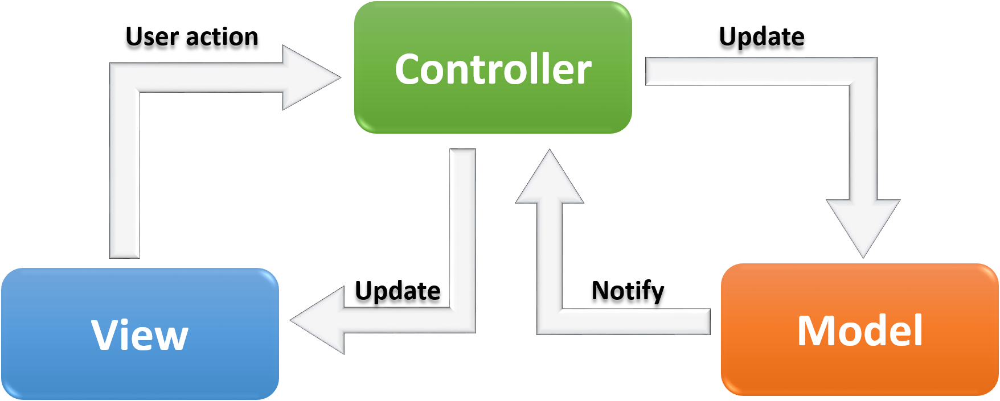

# Yallah-Ride

You wanna Ride ? You wanna share your Ride ?
what are you waiting for ? JOIN US NOW !!

## Getting Started

### Setup

```js
// clone this repository
~ git clone 

// cd into the project directory
~ cd Yallah-Ride
```


#### `.env` requirements (where applicable)

- `PORT` - 3000
- `MONGODB_URI` - mongodb://localhost:27017/please

#### How to initialize/run your application (where applicable)

- e.g. `npm start`


## Running the tests

- Testing Framework jest test runner
- eslint 
- Pull requests are not merged until all jest tests pass.


## Deployment

Add additional notes about how to deploy this on a live system

## Authors

* **AbdelRahman Harasees** - *Initial work* - [PurpleBooth](https://github.com/dantemessy)

* **Rashid Sawalqa** - *Initial work* - [PurpleBooth](https://github.com/Rashid-alsawalqa)

* **Fatima Shubeilat** - *Initial work* - [PurpleBooth](https://github.com/FatimaShubeilat)

## License

This project is licensed under the MIT License - see the [LICENSE.md](LICENSE.md) file for details

## Acknowledgments

* Hat tip to Mr.Brian, our instructor and inspiration.

# Overview

* Our application is a RESTful API, that helps to implement all the knowledge that we learned through 401 advanced javascript course, that is introduced by LTUC and powered by Codefellows, as well as learning new aspects and implementations that is provided by documentations and other resources. 
At this application you have the full CRUD (create, read, update, delete) data operations which its oriented for our driving/riding offers.

# What is Yallah-Ride?

Same as hitchhiking idea which is used to get a lift with passing vehicles when travelling, and with the use of applications, we can provide through Yallah-Ride a more secure and a safer way than hitchhiking.

# Why Yallah-Ride  

* Provide alternative ride for people than using a bus, a train, or a taxi.
* Reducing the cost, as the ride cost will split on both driver and rider, even there would be an option if the driver only wants to have company so offers a free ride.
* You will have the chance to meet friendly people on the application, which then would give you a life time friendship!
* Reducing the pollution and saving the environment 
* Decreasing the use of cars which will reduce the traffic, as well as it will help to reduce the pollutant emission.

## How does it work?

Yallah-Ride is where a user can search for available pickups that has the same destination that he is willing to go to. The Yallah-Ride services includes the following:

- The data is manually created, for testing the results that shows at the search page.
- Sign-in/sign-up page shows the username that is needed and the password. 
- Allow customer to create an account either by the website itself or using Facebook account to sign-up/sign-in.
- When the user do the sign-in/sign-up process, he will be able to see the dashboard which shows all the information.
- The dashboard will show the option of filling the form, there would be 2 form types, the first one for the rider's request and the second one is the driver's request. That allow customer to select and book a pickup also to find new rides.
- the user also have a search button that enables him to search for either driver requests or rider requests, that filters the results based on your choice.
- Each request has different data that is shown to the user as follows:
- A driver fills in a form and add information about time to start the trip up, cost, and the destination that shows the city in specific and the street name/number, the car type, and the available number of seats.
- A rider finds the driver's posts and get in touch with the driver to discuss details, also the rider can post a request by filling a form and add information about time to be picked up, cost, and the destination that shows the city in specific and the street name/number.
- The driver is not required to do extra services, he is only required to got to the stated destination that he has shared.
- No extra money is charged from the rider.
- A cost feature will show three options that is determined by the rider's side to state that it does cost some amount of money that implies that riders must participate in the sharing ride cost. Also there is an option that will show that 


# Current Version (0.0.0)

The current version of this program is designed to create, read, update, delete for the user account, and the posts.
This API is scalable so its expected to be developed and to release new versions.

# Future Releases

V 1.0.0 will include the following enhancements:

* Let customers share live trip with friends and family
* Show trip summary with distance travelled
* Driver can look for passengers who have a driving license.
* Adding the temper and mood for the companion may sound important for some drivers/riders, that may show if they are interested for chatting during the long rides.
* Routes will be tracked via GPS
* Adding multiple payment methods

# Architecture

This API adopts the Model View Controller(MVC) pattern.



This is a server-side and client-side application, each using an architecture/framework that promotes maintainability, scalability, and collaboration. 


The technologies that we have applied are node.js server, node.http module, express middleware, and a mongo database. Unix, Git, GitHub, ESLint, MongoDB, Heroku, Continuous integration, ES6, JSDoc, Swagger, Jest, Socket.IO, Express

Concepts that we went through to fully understand how to program this application Concepts: Structural Design Patterns, Client / Server architecture, TCP and HTTP, NoSQL Databases, RESTful API, Authentication / Authorization, Data Modeling, Test-Driven Development, Behavior-Driven Development, Unit, Integration, and End-to-End Testing, Object-Oriented Programming, Functional Programming, Code Readability and Maintainability, Version Control, Continuous Integration and Deployment, Debugging, Web Sockets, Event-Driven Applications, Asynchronous Programming.


## Middleware:

* Express router middleware that provides base routing.
* Module that handle the errors.
* An authentication/authorization module that provide user sign-up/sign-in functionality
* Mongo to handle the application database and controlling it using mongoose module.

When user signs up it first check if its already in database or not:

```js
users.save = async function (data){
  let scanResult = await Model.get(data.info.name);
  let search;
  if(scanResult[0]){
    search =scanResult[0].info.name ;
  }
  ```
If its not there, it will hash it:

  ```js
  if(!(search === data.info.name)){
    data.info.password = await bcrypt.hash(data.info.password , 5);
    await Model.create(data);
    return data ;
  }else{
    return data;
  }
};
```
And then store it inside the schema:

```js
  info: {
    name: { type: String, required: true },
    gender: { type: String, required: true },
    smoker: { type: Boolean, required: true},
    password: { type: String, required: true },
  },
```
Let's say the user already signed in now, it will first generate a token to allow it to access the routes inside the application, that he will be redirected to his own dashboard, where he can update his information using CRUD operations.
And now he will be able to access route of the riders and drivers, also will be able to show all the requests from both sides: driver/rider side.

